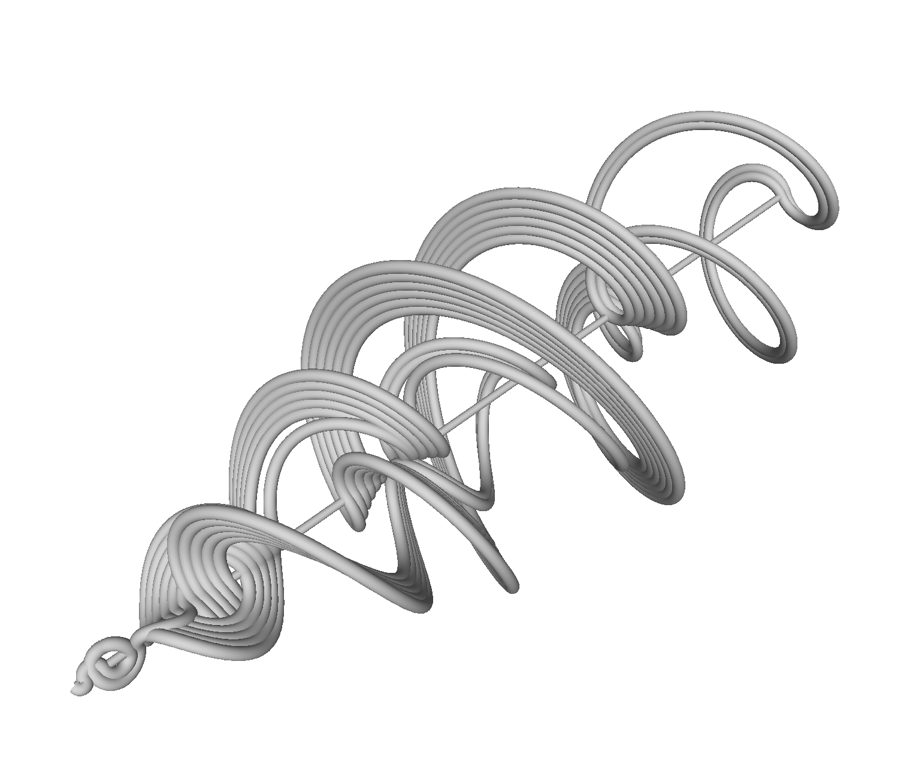

# TwistedRecamanSequence
Recamán's sequence twisted in 3d

Inspired by the Numberphile video https://www.youtube.com/watch?v=FGC5TdIiT9U this short code will generate the Recamán's sequence and connect its points by twisted arcs. The result is an `.obj` mesh. https://pinshape.com/items/57246-3d-printed-twisted-recamans-sequence

